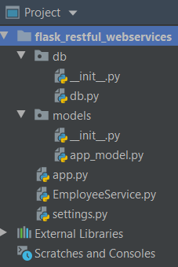

# Flask Webservices Using Flask-Restful :


#### Project Setup

  - Making the project as :
    ```
    mkdir flask_restful_webservices
	cd flask_restful_webservices
    ```
  - Install flask:
    ```
    pip3 install flask
    ```
 - Integrating SqlAlchemy
    ```
    pip3 install sqlalchemy
    ```
  - Integrating flask-rest
    ```
    pip3 install flask-restful
    ``` 
  - create project architecture like below
  
      
     
  - Create EmployeeService.py for development
     ```python
    from flask import jsonify

    from db.db import db
    from models.app_model import Employee
    
    
    def get_employees():
        employees = Employee.query.all()
        return jsonify(employees=[e.serialize() for e in employees])
    
    
    def get_employee(employee_id):
        employee = Employee.query.filter_by(id=employee_id).first()
        return jsonify(employee=employee.serialize())
    
    
    def create_employee(name, email, contact):
        employee = Employee(name=name, email=email, contact=contact)
        db.session.add(employee)
        db.session.commit()
        return jsonify(employee=employee.serialize())
    
    
    def update_employee(employee_id, name, email, contact):
        employee = Employee.query.filter_by(id=employee_id).first()
        employee.name = name
        employee.email = email
        employee.contact = contact
        db.session.commit()
    
        return 'Updated a Employee with id %s' % employee_id
    
    
    def delete_employee(employee_id):
        employee = Employee.query.filter_by(id=employee_id).one()
        db.session.delete(employee)
        db.session.commit()
        return 'Removed Employee with id %s' % employee_id

     ```   
  - Create app.py for development
     ```python
    from flask import Flask, request
    from EmployeeService import get_employees, create_employee, update_employee, delete_employee, get_employee
    from db.db import db
    from models.app_model import Employee
    
    app = Flask(__name__)
    app.secret_key = 'asrtarstaursdlarsn'
    app.config.from_object('settings.Config')
    
    # initialization
    db.init_app(app)
    
    
    @app.route('/employee', methods=['GET', 'POST'])
    def employeeFunction():
        if request.method == 'GET':
            return get_employees()
        elif request.method == 'POST':
            data = request.get_json()
            return create_employee(name=data['name'], email=data['email'], contact=data['contact'])
    
    
    @app.route('/employee', methods=['PUT'])
    @app.route('/employee/<int:employee_id>', methods=['GET', 'DELETE'])
    def employees(employee_id=None):
        if request.method == 'GET':
            return get_employee(employee_id)
    
        elif request.method == 'PUT':
            data = request.get_json()
            return update_employee(employee_id=data['id'], name=data['name'], email=data['email'], contact=data['contact'])
    
        elif request.method == 'DELETE':
            return delete_employee(employee_id)
    
    
    # run always put in last statement or put after all @app.route
    if __name__ == '__main__':
        app.run(host='localhost')
    
    # manager.run()

     ```
  - Declaring Models:
     ```python
    from db.db import db
    class Employee(db.Model):
        id = db.Column(db.Integer, primary_key=True)
        name = db.Column(db.String(255), nullable=False)
        email = db.Column(db.String(255), nullable=False)
        contact = db.Column(db.String(10), nullable=False)
    
        def serialize(self):
            return {
                'name': self.name,
                'email': self.email,
                'contact': self.contact,
                'id': self.id,
            }
     ``` 
  - In order to run app:
     ```
	   python app.py
     ```

  - run on your Postman
    * You should run get employees: http://localhost:5000//employee/
        you should run get by id: http://localhost:5000//employee/<int:employee_id>        